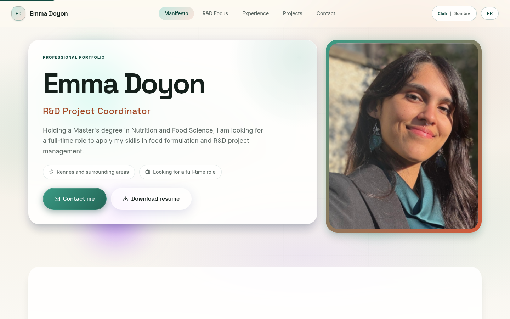

# edoyon.fr — portfolio professionnel bilingue

**Contexte :** site public réalisé pour Emma Doyon, en R&D nutrition.  
**Rôle :** conception et développement du site de bout en bout.

## Besoin

Présenter un parcours professionnel, des expériences, des compétences et des projets dans un site facile à consulter et à partager.

## Réalisation

- Structure de contenu centrée sur le parcours et les projets.
- Navigation en français et en anglais.
- Interface adaptée aux écrans mobiles et aux ordinateurs.
- Thèmes clair et sombre, accès au CV et navigation entre les sections.

**Technologie attestée dans le portfolio :** Next.js. Le dépôt source du site client n'est pas publié ici ; je n'attribue pas d'autres technologies non vérifiables.

## Résultat et limites

Le site est accessible publiquement. Aucune métrique de trafic, de référencement ou de conversion n'est revendiquée.

[Voir le site livré](https://www.edoyon.fr/) · [Étude de cas complète sur msafla.fr](https://msafla.fr/projet/edoyon)
