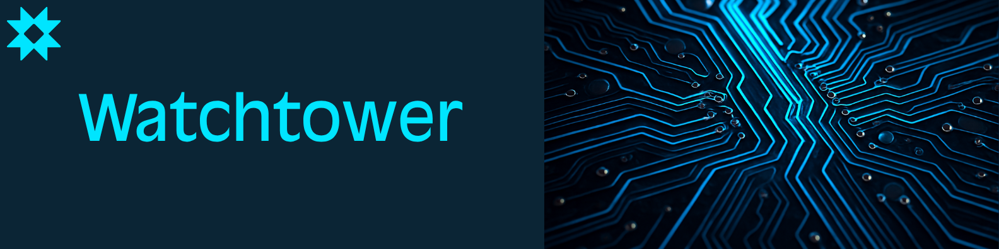

# Watchtower — pilotage des contrôles de sécurité

**Contexte :** projet interne réalisé chez Skaleet.  
**Rôle :** conception et développement d'un outil de suivi, pendant mon stage puis mon activité de consultant cybersécurité.

## Problème

Un plan annuel de contrôle mobilise plusieurs sources, des fréquences différentes et des actions correctives à suivre. Sans vue commune, il devient difficile de relier chaque contrôle à son résultat, à sa preuve et à sa remédiation.

## Contribution

- Centralisation du suivi des contrôles périodiques et de leurs résultats.
- Automatisation d'une partie de la collecte et du reporting.
- Visualisation des contrôles, des remédiations et des informations utiles aux parties prenantes.
- Intégration avec les outils utilisés par l'équipe sécurité.

**Technologies présentées dans le portfolio :** Python, JavaScript, API Atlassian, API Slack, API Cyberwatch, Docker.

## Résultat et limites

Le projet fournit une vue plus cohérente du plan de contrôle et des actions à suivre. Aucun gain de temps chiffré ni nombre de contrôles n'est revendiqué publiquement. Les données, configurations et sources internes ne sont pas publiées.

[Étude de cas complète sur msafla.fr](https://msafla.fr/projet/watchtower)
